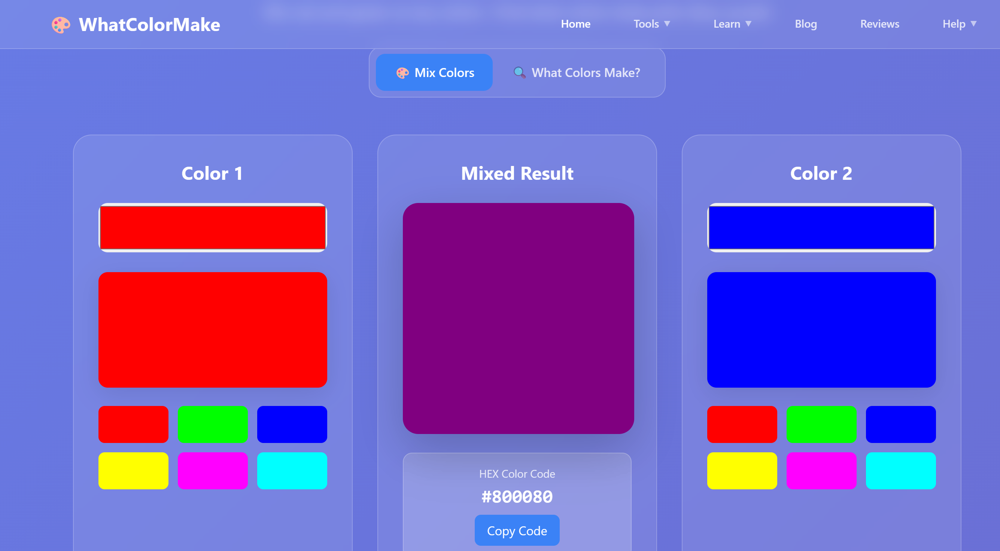

## 🎨 WhatColorMake.com - Interactive Color Mixer & RGB Color Picker

> Discover what two colors make any color! Perfect for designers, artists, and developers.

[🌐 Visit Website](https://whatcolormake.com)

------

### 🧠 About This Project

**[WhatColorMake.com](https://whatcolormake.com)** is a free, intuitive online tool that helps you discover color mixing combinations. Whether you're a graphic designer, art student, frontend developer, or hobbyist, this tool helps you find out:

- What colors make **purple**, **green**, **orange**, and more
- The **RGB** and **HEX** values of each mix
- Live previews with smooth sliders
- Reverse color mixing suggestions (e.g. *“What two colors make teal?”*)

------

### ✨ Features

- 🎨 **Interactive Color Mixer** – Mix any two colors and see the result instantly.
- 📌 **Reverse Color Lookup** – Find out what two colors make your desired color.
- 🌈 **RGB and HEX Values** – Precise control and code-ready values.
- 🧪 **Color Experiments** – Explore unexpected mixes, visualize contrast and harmony.
- ⚡ **Lightweight & Fast** – Pure front-end site, no login or ads.

------

### 📸 Screenshot (建议添加图片)

```

```

------

### 🔍 Use Cases

- 🎨 **Designers**: Find the best base colors to mix for your palette.
- 👩‍🏫 **Art Educators**: Explain color theory in a fun, visual way.
- 🧑‍💻 **Frontend Developers**: Grab instant HEX codes for your designs.
- 👧 **Kids & Students**: Learn what happens when you mix red and blue!

------

### 🚀 Try It Now

Explore instantly: https://whatcolormake.com

Want to know *“What color does red and green make?”* Try it now!

------

### 🤝 Contribute or Share

If you like this project:

- 🌟 **Star this repo**
- 🔗 **Share the website on social media or blog**
- 🧩 **Submit issues or ideas**

------

### 📬 Contact

Got feedback or collaboration ideas?

> 📧 Email: contact@whatcolormake.com
>  💡 Let's make color theory more accessible, fun, and visual!

------

### 🏷️ Keywords

```
color mixer` · `what color make` · `rgb color tool` · `color theory` · `web design tool` · `hex generator
```
